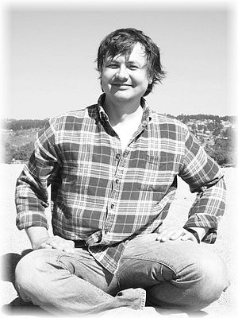

# About Me

> _I’m a true hacker. I deeply research what attracts my attention to know how it works and how it can be used curiously. Doesn't matter if it's things, computer programs or even people._

Currently I looking for applying my skills and knowledge in machine-human interaction/symbiosis. So I doing some projects related to digital health and noninvasive interconnection/sensing human neural system. It means I make not only PC software but both my own hardware and firmware for existing common hardware like fitness wristbands. 

Scince human neural system, phisiology, behaviour and mentality are variating from one to other it also requires good knowledge in machine learning and data mining. So another things I learn and practice in are applied Artifitial Intelligence and common Data Scince.

# My Projects

To research something interesting me I often do tiny pet project. Sometimes it becomes not so tiny ;). I have a lot pet projects and not all of them are presented in my github. By the way you can simply look in my GitHub profile to find more. There I count only last projects related to my current interests.

### Myelofon &nbsp; _[sudachen.github.io/Myelofon](https://sudachen.github.io/Myelofon)_
**Myelofon** is a brain waves spectrum analyzer.

### uCcm &nbsp; _[sudachen.github.io/uccm](https://sudachen.github.io/uccm)_
**uCcm** is an uC Cortex-M building tool and modules manager.

### Applied AI Group &nbsp; _[lnked.in/aaigroup](https://lnked.in/aaigroup)_
**Applied Artificial Intelligence** is a linkedin group related to aplications of the artifitial intelligance. It has more than 17K members.
